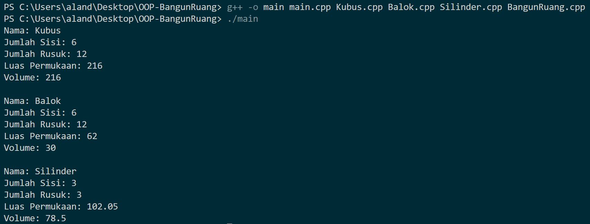

<div align="center">
  
  <p><i>Aksantara ITB 2024</i></p>
</div>

# OOP-BangunRuang
> Implementasi lanjut dari Object Oriented Programming (OOP) pada Bangun Ruang seperti kubus, balok, dan silinder

🎓 **Latar Belakang:**
Repository ini dibuat untuk memenuhi kewajiban tugas individu mengenai implementasi OOP lebih lanjut dalam menempuh pendidikan sebagai Calon Robotics Software Control jurusan firmware dalam Aksantara ITB 2024.

## 📝 Tugas Wajib
Buatlah abstract base class bernama BangunRuang.
Kelas BangunRuang:
- Punya member jumlah sisi dan jumlah rusuk, serta nama bangun ruang
- Punya constructor, getter, serta virtual method getArea dan getVolume

Turunkan kelas BangunRuang ke tiga kelas: **Kubus**, **Balok**, **Silinder**.
Setiap kelas turunan mempunyai konstruktor masing-masing.
Implementasikan getArea dan getVolume pada tiga kelas turunan ini.
Tambahkan atribut pada masing-masing kelas turunan bila perlu.

Buatlah file menjadi modular. Bagi file menjadi 5 buah, yaitu
BangunRuang.cpp, Kubus.cpp, Balok.cpp, Silinder.cpp, dan main.cpp.
Implementasikan file header (BangunRuang.h, dst) kecuali untuk main.cpp
Main.cpp berisi fungsi main untuk mengetes bangun ruang yang telah
dibuat. Jangan lupa melakukan include header pada main.cpp.

## 📝 Tugas Bonus
Implementasi bangun ruang yang kalian pada Arduino. Sangat disarankan untuk hands-on arduino (jika masih belum ada gunakan https://www.tinkercad.com/). Metode implementasi dibebaskan, namun minimal dapat menggunakan sensor seperti LED atau servo. Wajib menerapkan prinsip OOP.

Contoh-contoh yang dapat digunakan:
1. User dapat menerima input sinyal dari potentiometer dan melakukan Serial.print terhadap jenis bangun ruang sesuai dengan angka potentiometer dari analogread
2. User dapat menyalakan 3 jenis LED dan print jenis bangun ruang sesuai jenis LED tersebut.


## 📁 Struktur Program
```bash
Tugas1_RSC_13522124
├─ Balok.cpp
├─ Balok.hpp
├─ BangunRuang.cpp
├─ BangunRuang.hpp
├─ Kubus.cpp
├─ Kubus.hpp
├─ Silinder.cpp
├─ Silinder.hpp
├─ main.cpp
└─ README.md
```

## Screenshots

<div align="center">
  
  <p><i>Uji Coba Program Wajib</i></p>
</div>